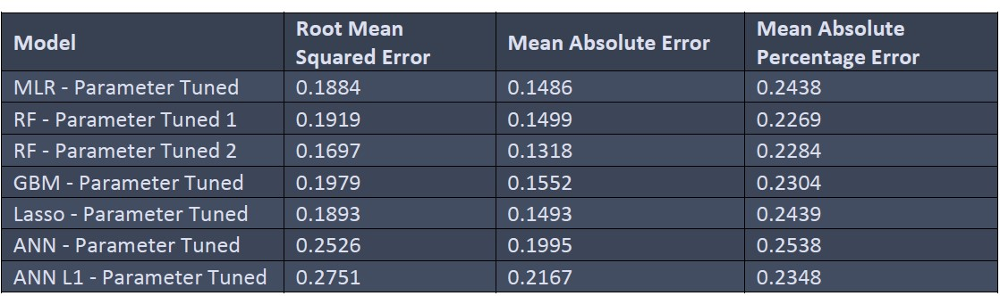

# Irish-Property-Price-Prediction-Regression-Analysis

## Introduction

Property price prediction is a very important area of research given the significance of real estate to a nation’s economy and how much people are invested in buying a dream house in terms of money and time. The cost of a property is influenced by a number of factors, for instance the neighbourhood it is situated in, house size, and age of the property. These factors along with range of other factors contribute to the varying trend of housing prices, which has led to numerous research on house price prediction.
This research focuses on the analysis of Ireland's residential property price register data, which includes location-specific information on every residential property sold in the last decade. Traditional and advanced regression techniques were applied to predict the price of a property based of various attributes. This work applied several machine learning techniques like Multiple linear regression, Random Forest, Lasso Regression and Gradient boosting regression methods. Deep learning methods have shown promising results in varies fields in recent year. In this study a deep connected Artificial Neural Network (ANN) was applied. This research focusses on finding the optimal solution from the above-mentioned regression techniques in designing a model which could be used in predicting property prices.
The results show that the Random Forest regression model performed best compared to other regression techniques and predicts Irish property prices with the lowest error rate. The Random Forest model was able to predict the property price with an average absolute error of 0.16 units in a standardised form. Furthermore, by visualising the data using different graphs and plots along with a Geographical Information map yielded many valuable details which will serve to aid in decision making for Irish real estate market consumers.

## Dataset used for study

The Irish Residential Property Price Register dataset was used in this study and was sourced from the Property Service Regulatory Authority (PSRA) of Ireland. The residential property register information is a compilation of details individuals provided to the appropriate revenue commissioners as part of the stamp duty collection for the registration of properties in various counties of Ireland from 2010. The PSRA also has data on the commercial lease registry, however the information is far more limited and only includes the cost and location of the commercial premises. Therefore, only residential property registry data was considered for analysis and price prediction in this study.

The data includes information about property sales for the period from January 2010 to June 2022, totalling more than 540,000 records. There were nine variables in the dataset, including Date of Sale, Price, Address, and County. In addition, the size of the property was also available which is divided into four separate categories in square meter units. The description of the property specifies whether it is a new, second hand or restored house. For the second hand and restored house the time period information of how old the property is, is not available.

## Data cleaning and Pre-processing
1. Data Cleaning
2. Handling of categorical variables 
	
	One-hot encoding technique
3. Feature extraction of datetime variables
	
	Details deduced: year, month, day of the week, and whether the sale occurred at the beginning of the year or the quarter
	Cyclic encoding is a methodology
4. Missing values
	
	Random Forest classifier model was used to handle missing data using available data points
5. Outlier detection and handling
	
	IQR methodology was used to handle outliers
6. Transforming data for Normality
	
	Square root transformation was applied on the data to reduce the right skewness

## Regression Methodologies 
1. Multiple Linear Regression 
2. Random Forest Regression
3. Gradient Boosting Regression 
4. Lasso Regression 
5. Artificial Neural Network 

## Evaluation metrics for regression analysis
1. Root Mean Squared Error
2. Mean Absolute Error
3. Mean Absolute Percentage Error

## Baseline regression model results

As the initial step in regression model development to predict property price, baseline models were developed. The error metrics for each of the five models are shown in Table. The same results are displayed graphically in Figure. The evaluation metrics RMSE, MAE and MAPE are used to compare the models.

From the results it can be observed that the Random Forest model performs better than all the other model with the lowest RMSE, MAE and MAPE values of 0.1679, 0.13 and 0.2345 respectively. The RMSE value indicates the overall average distance between the actual values and the predicted values, thus in a normalised dataset, on average a predicted value will
deviate by 0.1679 units from the actual value when using the RF model. The MAPE value indicates the error in terms of percentage, with 0.2345 the average absolute percentage error. Therefore, the predicted value deviate from the actual value by 23.5%. The RF model performance can be classified as good, since a MAPE value less 25% is considered an acceptable regression model for prediction.

## Tuned regression model results

The results with the error metrics for the 7 models developed (hyperparameter tuned) are shown in the Table 6. The model results are shown graphically using a bar chart for comparison in Figure.
The RF model had the best performance based on the results of the baseline models. Upon tuning the model with several combinations of parameters two models were identified with better MAPE value. From Table 6, the Grid Search methodology produced the RF - Parameter Tuned 1 model, whereas the top performing model was manually tuned to produce the RF - Parameter Tuned 2. Overall, the RF model 2 is the best performing compared to all other regression techniques. From the parameters fed, this model consists of a total of 300 decision trees to produce the most efficient results.
Results from the RF model 2 include RMSE, MAE, and MAPE values of 0.1697, 0.1318, and 0.2284, respectively. With similar RMSE and MAE and a significant improvement of MAPE value the parameter tuned RF model outperformed its baseline performance. The MAPE score indicates that, on average, predictions differ from actual values by 22.84%, which is less than the baseline RF performance of 23.54%.

The MLR, Lasso and GBM models all showed considerable improvement compared to their respective baseline models based on the error. The MLR and Lasso regression models showed similar results after the models were tuned with their best parameters. The models performed with error values of 0.18, 0.14 and 0.24 (RMSE, MAE and MAPE). The two ANN models tuned, the one with and without being regularised both did not show any significant improvement from the baseline ANN models. The ANN model performed poorly with all error metrics above 0.20 units.

## Future Work

More accurate prediction requires better data or data collecting. The Irish property register data contains only minimal information about each property. For instance, a property's pricing is significantly influenced by the qualities it offers, such as the number of rooms, bathrooms, and distance from a city’s intersection etc. This in-depth information is lagging in the Irish Property data. With better data, containing more features the efficiency of the predictive model can be improved.

The study can be further extended by including Irish commercial lease information dataset.

## Data analysis and Insights

https://github.com/Venkat-R7/PSRA-Property-Price-Register-Analysis-Tableau

Interpretation of the data is very important as it could help in deriving meaningful information for appropriate decision making. The Irish property price register data was analysed using graphical techniques such as plots and maps to gain valuable insights. For a deeper understanding two other datasets were used as a reference. The county-wise population of Ireland was downloaded. The population details of Ireland are available for the years 2011, 2016 and 2022 from the official census and intermediate census data. To further analyse the demographic details, the area information of each county in Ireland was downloaded. The area dataset provides the size of each county in Ireland in km2.

Geographic information system (GIS) was used to visualise the data geographically utilising location-based information. GIS is a system that uses data with unique location-based information to display it on a map which allows location-based pattern recognition, clustering of information and predictive forecasting. Two maps were created using the Irish property price data. The first map is plotted with the average change in county-by-county real estate prices over time. While every property sale detail is mapped on the second plot.
Each property’s address is listed in the Irish property price registry, however latitude and longitude are needed for each location in order for this information to be plotted on a map.
To get the latitude and longitude information, Geo-Coding technique was used. Geo-Coding is the process of locating a place using latitude and longitude by means of its address or place name. There are several applications that support Geo-Coding like Google Earth.

The study encountered a bottleneck since geo-coding often has a daily rate limit and comes with a high cost. Google Earth is the most reliable and accurate platform available, however it allows only 2500 locations to be geo-coded per day, beyond this limit the information comes at a cost. Considering this, an open-source application ‘Nominatim’ was used to Geo-Code the data. Nominatim is less accurate compared to Google Earth. In some cases, Nominatim was not able to find a few locations and also mis-located some places. Considering the resource limitation and the per day Geo-Coding rate limit, properties in South and South-Western counties of Ireland were Geo-Coded as a proof of concept.

